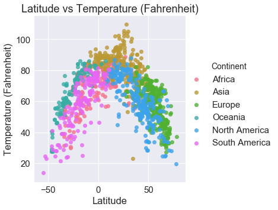
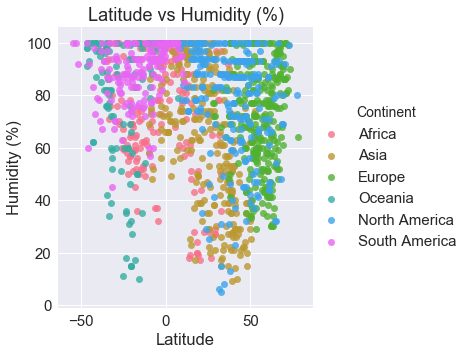
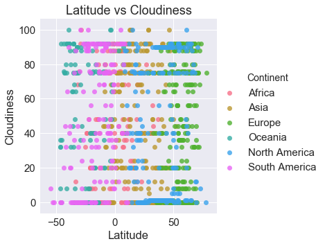
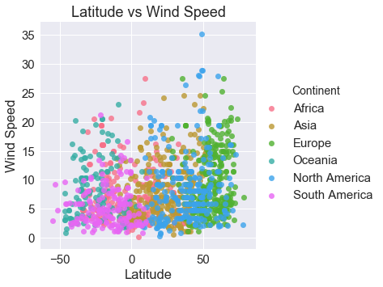

# WeatherPy: Weather Analysis Based on Latitude (6/4/2018)

Based on this analysis, latitude can only be used to predict temperature and demonstrates no relationship with a city's humidity, cloudiness, or wind speed.

To perform this analysis:
- To ensure a good sample of data, I generated 1,500 random, unique cities around the world using a combination of randomized latitude/longitude pairs and Citipy (to ensure I returned an actual city, not just a location on a map). Not all of these cities return results when searching OpenWeatherAPI, and I wanted to make sure that I had at least 1,000 data points.
- To ensure that I didn't have false positives when determining if a city was a duplicate (for example, Bagdhad, Arizona and Baghdad, Iraq are two very different cities), I created a pseudo-hash by combining the city and country names.
- I pulled weather data that corresponded to those cities from OpenWeatherMap on 6/4/2018 at approximately 11 PM PST.


```python
# -----------------------------------------------------------------------------------
# Step 1: Import the modules 
# -----------------------------------------------------------------------------------
import seaborn as sns
import json
import matplotlib.pyplot as plt
import requests as req
import pandas as pd
import random as rd
from citipy import citipy
from localenv import api_key
from aux import displayProcessingCity, displayFailedCity, continentFromCountry
```

## City Data


```python
# -----------------------------------------------------------------------------------
# Step 2: Store all our basic API data. I'd use params, but I couldn't get it to work
# with the unique structure of some of these parameters
# -----------------------------------------------------------------------------------

tempUnits = 'Imperial'
openWeatherURL = "http://api.openweathermap.org/data/2.5/weather?"
```


```python
# -----------------------------------------------------------------------------------
# Step 3: Create a list of non-duplicate cities
# -----------------------------------------------------------------------------------
# create a list that we'll store all our data in
weatherData_list = []
city_list = []

# create dupe checking set
cityDupeChecker = set()

# create counter
i = 0

# create a list of 1500 possible cities (so even if a query fails still have good sample)
while len(cityDupeChecker) < 1500:
    
    # set random lat and long
    latitude = rd.uniform(-90.0,90.0)
    longitude = rd.uniform(-180.0,180.0)
    
    # get city
    city = citipy.nearest_city(latitude,longitude).city_name
    country = citipy.nearest_city(latitude,longitude).country_code
    city_country_pair = f"{city}_{country}"
    
    if city_country_pair not in cityDupeChecker:
        cityDupeChecker.add(city_country_pair)
        
        # try to pull in a random value and add to dupe checker
        city_list.append([city, country])
```


```python
# -----------------------------------------------------------------------------------
# Step 4: Pull city data from openweatherapi
# -----------------------------------------------------------------------------------
for i in range(len(city_list)):
    
    # get current city and country
    city = city_list[i][0]
    country= city_list[i][1]
        
    # try searching by city + country code
    try:
        response = req.get(f"{openWeatherURL}q={city},{country}&units={tempUnits}&APPID={api_key}").json()
        
        # add information from response to list
        weatherData_list.append({'ID':response['id'],
                                 'City': response['name'],
                                 'Country': country.upper(),
                                 'Continent': continentFromCountry(country.upper()),
                                 'Latitude':response['coord']['lat'],
                                 'Longitude':response['coord']['lon'],
                                 'Humidity (%)':response['main']['humidity'],
                                 'Temperature (Fahrenheit)':response['main']['temp'],
                                 'Wind Speed':response['wind']['speed'],
                                 'Cloudiness':response['clouds']['all'] })
        
        #show city
        #displayProcessingCity(i,response)
    except:    
        try:
            response = req.get(f"{openWeatherURL}q={city}&units={tempUnits}&APPID={api_key}").json()
            
            # add information from response to list
            weatherData_list.append({'ID':response['id'],
                                     'City': response['name'],
                                     'Country': response['main']['sys']['country'].upper(),
                                     'Continent': continentFromCountry(response['main']['sys']['country'].upper()),
                                     'Latitude': response['coord']['lat'],
                                     'Longitude': response['coord']['lon'],
                                     'Humidity (%)':response['main']['humidity'],
                                     'Temperature (Fahrenheit)':response['main']['temp'],
                                     'Wind Speed':response['wind']['speed'],
                                     'Cloudiness':response['clouds']['all']})
                                    
            #show city
            #displayProcessingCity(i,response)
        except:
            #displayFailedCity(i, city, country)
            pass
```


```python
# -----------------------------------------------------------------------------------
# Step 4: Create a pretty dataframe that we can reference because visual aids are
# the actual best thing ever and export a CSV we can hang onto
# -----------------------------------------------------------------------------------
cleanedWeather_df = pd.DataFrame(weatherData_list).set_index('ID')

# rearrange columns sensibly
cleanedWeather_df = cleanedWeather_df[['City', 'Country', 'Continent',
                                       'Latitude', 'Longitude',
                                       'Temperature (Fahrenheit)', 
                                       'Humidity (%)', 
                                       'Wind Speed',
                                       'Cloudiness']].sort_index(ascending=True)

# export the csv
cleanedWeather_df.to_csv("WeatherData.csv")

# eyeball our data
cleanedWeather_df.head()
```


<div>
<table border="1" class="dataframe">
  <thead>
    <tr style="text-align: right;">
      <th></th>
      <th>City</th>
      <th>Country</th>
      <th>Continent</th>
      <th>Latitude</th>
      <th>Longitude</th>
      <th>Temperature (Fahrenheit)</th>
      <th>Humidity (%)</th>
      <th>Wind Speed</th>
      <th>Cloudiness</th>
    </tr>
    <tr>
      <th>ID</th>
      <th></th>
      <th></th>
      <th></th>
      <th></th>
      <th></th>
      <th></th>
      <th></th>
      <th></th>
      <th></th>
    </tr>
  </thead>
  <tbody>
    <tr>
      <th>53654</th>
      <td>Mogadishu</td>
      <td>SO</td>
      <td>Africa</td>
      <td>2.04</td>
      <td>45.34</td>
      <td>82.40</td>
      <td>78</td>
      <td>12.75</td>
      <td>75</td>
    </tr>
    <tr>
      <th>57000</th>
      <td>Hobyo</td>
      <td>SO</td>
      <td>Africa</td>
      <td>5.35</td>
      <td>48.53</td>
      <td>82.00</td>
      <td>68</td>
      <td>21.61</td>
      <td>0</td>
    </tr>
    <tr>
      <th>60019</th>
      <td>Eyl</td>
      <td>SO</td>
      <td>Africa</td>
      <td>7.98</td>
      <td>49.82</td>
      <td>84.52</td>
      <td>61</td>
      <td>23.29</td>
      <td>0</td>
    </tr>
    <tr>
      <th>64814</th>
      <td>Bandarbeyla</td>
      <td>SO</td>
      <td>Africa</td>
      <td>9.49</td>
      <td>50.81</td>
      <td>81.64</td>
      <td>77</td>
      <td>27.54</td>
      <td>0</td>
    </tr>
    <tr>
      <th>69559</th>
      <td>Yarim</td>
      <td>YE</td>
      <td>Asia</td>
      <td>14.30</td>
      <td>44.38</td>
      <td>73.45</td>
      <td>25</td>
      <td>5.61</td>
      <td>80</td>
    </tr>
  </tbody>
</table>
</div>


```python
# -----------------------------------------------------------------------------------
# Step 5: Generate charts.
#  1) Temperature (F) vs. Latitude
#  2) Humidity (%) vs. Latitude
#  3) Cloudiness (%) vs. Latitude
#  4) Wind Speed (mph) vs. Latitude
# -----------------------------------------------------------------------------------
sns.set_style("darkgrid")
sns.set_context("notebook", font_scale=1.5, rc={"lines.linewidth": 2.5})

# Chart 1: Temperature vs Latitude
latVsTemp_plot = sns.lmplot(x='Latitude', 
                            y='Temperature (Fahrenheit)', 
                            data=cleanedWeather_df,
                            hue='Continent',
                            fit_reg=False, 
                            palette='husl')
plt.title("Latitude vs Temperature (Fahrenheit)")
plt.savefig("images/latXtemp.png")
plt.show()
```





```python
# Chart 2: humidity vs Latitude
sns.set_style("darkgrid")
sns.set_context("notebook", font_scale=1.5, rc={"lines.linewidth": 2.5})

latVsTemp_plot = sns.lmplot(x='Latitude', 
                            y='Humidity (%)', 
                            data=cleanedWeather_df,
                            hue='Continent',
                            palette='husl',
                            fit_reg=False)
plt.title("Latitude vs Humidity (%)")
plt.savefig("images/latXhumid.png")
plt.show()
```





There is no relationship between latitude and humidity.


```python
# Chart 3: cloudiness vs Latitude
sns.set_style("darkgrid")
sns.set_context("notebook", font_scale=1.5, rc={"lines.linewidth": 2.5})

latVsTemp_plot = sns.lmplot(x='Latitude', y='Cloudiness', 
                            data=cleanedWeather_df,
                            hue='Continent',
                            palette='husl',
                            fit_reg=False)
plt.title("Latitude vs Cloudiness")
plt.savefig("images/latXcloud.png")
plt.show()
```





There is no relationship between latitude and cloudiness.


```python
# Chart 4: wind speed vs Latitude
sns.set_style("darkgrid")
sns.set_context("notebook", font_scale=1.5, rc={"lines.linewidth": 2.5})

latVsTemp_plot = sns.lmplot(x='Latitude', y='Wind Speed', 
                            data=cleanedWeather_df,
                            hue='Continent',
                            palette='husl',
                            fit_reg=False)
plt.title("Latitude vs Wind Speed")
plt.savefig("images/latXwind.png")
plt.show()
```





There is no apparent relationship between latitude and wind speed.
