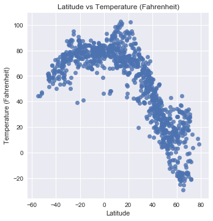
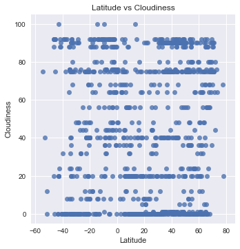

# WeatherPy: Weather Analysis Based on Latitude (3/1/2018)

Based on this analysis, latitude can only be used to predict temperature and demonstrates no relationship with a city's humidity, cloudiness, or wind speed. There appears to be a strong relationship between a city's latitude and its temperature, in that as the latitude approaches the equator, the temperature increases.

To perform this analysis:
- To ensure a good sample of data, I generated 1,000 random, unique cities around the world using a combination of randomized latitude/longitude pairs and Citipy (to ensure I returned an actual city, not just a location on a map).
- To ensure that I didn't have false positives when determining if a city was a duplicate (for example, Bagdhad, Arizona and Baghdad, Iraq are two very different cities), I used the unique ID that OpenWeatherMap assigns each city to eliminate my dupes.
- I pulled weather data that corresponded to those cities from OpenWeatherMap on 3/1/2018 at approximately 3:00 AM PST.


```python
# -----------------------------------------------------------------------------------
# Step 1: Import the modules 
# -----------------------------------------------------------------------------------
import seaborn as sns
import json
import matplotlib.pyplot as plt
import requests as req
import pandas as pd
import random as rd
from citipy import citipy
from localenv import apiKey

# also define my print function to make life cleaner
def displayProcessingCity(i,response):
    print(f"City #{i+1}")
    print(f"City URL: http://api.openweathermap.org/data/2.5/weather?id={response['id']}")
    print(f"City Name: {response['name']}")
    print(f"City ID: {response['id']}")
    print("----------------------------------------------------------------------------")  
```

## City Data


```python
# -----------------------------------------------------------------------------------
# Step 2: Store all our basic API data. I'd use params, but I couldn't get it to work
# with the unique structure of some of these parameters
# -----------------------------------------------------------------------------------

tempUnits = 'Imperial'
openWeatherURL = "http://api.openweathermap.org/data/2.5/weather?"
```


```python
# -----------------------------------------------------------------------------------
# Step 3: Pull data based on city IDs 
# -----------------------------------------------------------------------------------
# create a list that we'll store all our data in
weatherData_list = []

# create dupe checking set
cityDupeChecker = set()

# create counter
i = 0

# loop through all the cities, pull data and add to dictionaries, and print requested log information
while len(cityDupeChecker) < 1000:
    
    # set random lat and long
    latitude = rd.uniform(-90.0,90.0)
    longitude = rd.uniform(-180.0,180.0)

    # try to pull in a random value
    city = [citipy.nearest_city(latitude,longitude).city_name, citipy.nearest_city(latitude,longitude).country_code]
    
    # set value for current city and country code so we don't have to keep calling for it
    currentCityName = city[0]
    currentCountryCode = city[1]

    # get response
    try:
        response = req.get(f"{openWeatherURL}q={currentCityName},{currentCountryCode}&units={tempUnits}&APPID={apiKey}").json()
        
        try:
            if response['id'] not in cityDupeChecker:
                #show city
                displayProcessingCity(i,response)
            
                #increment counter
                i+=1
            
                # add to dupe checker
                cityDupeChecker.add(response['id'])

                # add information from response to list
                weatherData_list.append({'ID':response['id'],'Name': response['name'],\
                                         'Latitude':response['coord']['lat'],\
                                         'Humidity (%)':response['main']['humidity'],\
                                         'Temperature (Fahrenheit)':response['main']['temp'],\
                                         'Wind Speed':response['wind']['speed'],\
                                         'Cloudiness':response['clouds']['all'] })
        except:
            pass
    except Exception:
        pass
    else:    
        response = req.get(f"{openWeatherURL}q={currentCityName}&units={tempUnits}&APPID={apiKey}").json()
        
        try:
            if response['id'] not in cityDupeChecker:
                 #show city
                displayProcessingCity(i,response)
            
                #increment counter
                i+=1
            
                # add to dupe checker
                cityDupeChecker.add(response['id'])

                # add information from response to list
                weatherData_list.append({'ID':response['id'],'Name': response['name'],\
                                         'Latitude':response['coord']['lat'],\
                                         'Humidity (%)':response['main']['humidity'],\
                                         'Temperature (Fahrenheit)':response['main']['temp'],\
                                         'Wind Speed':response['wind']['speed'],\
                                         'Cloudiness':response['clouds']['all'] })
        
        except:
            pass
```

    City #1
    City URL: http://api.openweathermap.org/data/2.5/weather?id=3418910
    City Name: Upernavik
    City ID: 3418910
    ----------------------------------------------------------------------------
    City #2
    City URL: http://api.openweathermap.org/data/2.5/weather?id=889453
    City Name: Kadoma
    City ID: 889453
    ----------------------------------------------------------------------------
    City #3
    City URL: http://api.openweathermap.org/data/2.5/weather?id=2075265
    City Name: Busselton
    City ID: 2075265
    ----------------------------------------------------------------------------
    City #4
    City URL: http://api.openweathermap.org/data/2.5/weather?id=3833367
    City Name: Ushuaia
    City ID: 3833367
    ----------------------------------------------------------------------------
    City #5
    City URL: http://api.openweathermap.org/data/2.5/weather?id=6201424
    City Name: Mataura
    City ID: 6201424
    ----------------------------------------------------------------------------
    City #6
    City URL: http://api.openweathermap.org/data/2.5/weather?id=3463237
    City Name: Florianopolis
    City ID: 3463237
    ----------------------------------------------------------------------------
    City #7
    City URL: http://api.openweathermap.org/data/2.5/weather?id=3874787
    City Name: Punta Arenas
    City ID: 3874787
    ----------------------------------------------------------------------------
    City #8
    City URL: http://api.openweathermap.org/data/2.5/weather?id=3369157
    City Name: Cape Town
    City ID: 3369157
    ----------------------------------------------------------------------------
    City #9
    City URL: http://api.openweathermap.org/data/2.5/weather?id=2206939
    City Name: Bluff
    City ID: 2206939
    ----------------------------------------------------------------------------
    City #10
    City URL: http://api.openweathermap.org/data/2.5/weather?id=2175403
    City Name: Bluff
    City ID: 2175403
    ----------------------------------------------------------------------------
    City #11
    City URL: http://api.openweathermap.org/data/2.5/weather?id=3429594
    City Name: Reconquista
    City ID: 3429594
    ----------------------------------------------------------------------------
    City #12
    City URL: http://api.openweathermap.org/data/2.5/weather?id=5880568
    City Name: Bethel
    City ID: 5880568
    ----------------------------------------------------------------------------
    City #13
    City URL: http://api.openweathermap.org/data/2.5/weather?id=4030556
    City Name: Rikitea
    City ID: 4030556
    ----------------------------------------------------------------------------
    City #14
    City URL: http://api.openweathermap.org/data/2.5/weather?id=1633419
    City Name: Padang
    City ID: 1633419
    ----------------------------------------------------------------------------
    City #15
    City URL: http://api.openweathermap.org/data/2.5/weather?id=2450173
    City Name: Taoudenni
    City ID: 2450173
    ----------------------------------------------------------------------------
    City #16
    City URL: http://api.openweathermap.org/data/2.5/weather?id=3831208
    City Name: Qaanaaq
    City ID: 3831208
    ----------------------------------------------------------------------------
    City #17
    City URL: http://api.openweathermap.org/data/2.5/weather?id=5855927
    City Name: Hilo
    City ID: 5855927
    ----------------------------------------------------------------------------
    City #18
    City URL: http://api.openweathermap.org/data/2.5/weather?id=5563839
    City Name: Fortuna
    City ID: 5563839
    ----------------------------------------------------------------------------
    City #19
    City URL: http://api.openweathermap.org/data/2.5/weather?id=2517679
    City Name: Fortuna
    City ID: 2517679
    ----------------------------------------------------------------------------
    City #20
    City URL: http://api.openweathermap.org/data/2.5/weather?id=964432
    City Name: Port Alfred
    City ID: 964432
    ----------------------------------------------------------------------------
    [...]
    ----------------------------------------------------------------------------
    City #998
    City URL: http://api.openweathermap.org/data/2.5/weather?id=4852832
    City Name: Council Bluffs
    City ID: 4852832
    ----------------------------------------------------------------------------
    City #999
    City URL: http://api.openweathermap.org/data/2.5/weather?id=3394661
    City Name: Moju
    City ID: 3394661
    ----------------------------------------------------------------------------
    City #1000
    City URL: http://api.openweathermap.org/data/2.5/weather?id=1277008
    City Name: Barela
    City ID: 1277008
    ----------------------------------------------------------------------------


```python
# -----------------------------------------------------------------------------------
# Step 4: Create a pretty dataframe that we can reference because visual aids are
# the actual best thing ever and export a CSV we can hang onto
# -----------------------------------------------------------------------------------
cleanedWeather_df = pd.DataFrame(weatherData_list).set_index('ID')

# rearrange columns sensibly
cleanedWeather_df = cleanedWeather_df[['Name', 'Latitude', 'Temperature (Fahrenheit)',\
                                       'Humidity (%)', 'Wind Speed','Cloudiness']].sort_index(ascending=True)

# export the csv
cleanedWeather_df.to_csv("WeatherData.csv")

# eyeball our data
cleanedWeather_df.head()
```


<div>
<style scoped>
    .dataframe tbody tr th:only-of-type {
        vertical-align: middle;
    }

    .dataframe tbody tr th {
        vertical-align: top;
    }

    .dataframe thead th {
        text-align: right;
    }
</style>
<table border="1" class="dataframe">
  <thead>
    <tr style="text-align: right;">
      <th></th>
      <th>Name</th>
      <th>Latitude</th>
      <th>Temperature (Fahrenheit)</th>
      <th>Humidity (%)</th>
      <th>Wind Speed</th>
      <th>Cloudiness</th>
    </tr>
    <tr>
      <th>ID</th>
      <th></th>
      <th></th>
      <th></th>
      <th></th>
      <th></th>
      <th></th>
    </tr>
  </thead>
  <tbody>
    <tr>
      <th>53157</th>
      <td>Qandala</td>
      <td>11.47</td>
      <td>80.53</td>
      <td>59</td>
      <td>4.36</td>
      <td>0</td>
    </tr>
    <tr>
      <th>53654</th>
      <td>Mogadishu</td>
      <td>2.04</td>
      <td>87.80</td>
      <td>70</td>
      <td>14.99</td>
      <td>20</td>
    </tr>
    <tr>
      <th>57000</th>
      <td>Hobyo</td>
      <td>5.35</td>
      <td>84.04</td>
      <td>64</td>
      <td>12.64</td>
      <td>0</td>
    </tr>
    <tr>
      <th>58933</th>
      <td>Garowe</td>
      <td>8.41</td>
      <td>90.83</td>
      <td>36</td>
      <td>7.72</td>
      <td>0</td>
    </tr>
    <tr>
      <th>60019</th>
      <td>Eyl</td>
      <td>7.98</td>
      <td>82.51</td>
      <td>74</td>
      <td>11.97</td>
      <td>0</td>
    </tr>
  </tbody>
</table>
</div>


```python
# -----------------------------------------------------------------------------------
# Step 5: Generate charts.
#  1) Temperature (F) vs. Latitude
#  2) Humidity (%) vs. Latitude
#  3) Cloudiness (%) vs. Latitude
#  4) Wind Speed (mph) vs. Latitude
# -----------------------------------------------------------------------------------
sns.set()

# Chart 1: Temperature vs Latitude
latVsTemp_plot = sns.lmplot(x='Latitude', y='Temperature (Fahrenheit)', data=cleanedWeather_df,\
                           fit_reg=False)
plt.title("Latitude vs Temperature (Fahrenheit)")
plt.savefig("latXtemp.png")
plt.show()
```





```python
# Chart 2: humidity vs Latitude
latVsTemp_plot = sns.lmplot(x='Latitude', y='Humidity (%)', data=cleanedWeather_df,\
                           fit_reg=False)
plt.title("Latitude vs Humidity (%)")
plt.savefig("latXhumid.png")
plt.show()
```


There is no relationship between latitude and humidity.


```python
# Chart 3: cloudiness vs Latitude
latVsTemp_plot = sns.lmplot(x='Latitude', y='Cloudiness', data=cleanedWeather_df,\
                           fit_reg=False)
plt.title("Latitude vs Cloudiness")
plt.savefig("latXcloud.png")
plt.show()
```





There is no relationship between latitude and cloudiness.


```python
# Chart 4: wind speed vs Latitude
latVsTemp_plot = sns.lmplot(x='Latitude', y='Wind Speed', data=cleanedWeather_df,\
                           fit_reg=False)
plt.title("Latitude vs Wind Speed")
plt.savefig("latXwind.png")
plt.show()
```


There is no apparent relationship between latitude and wind speed.
